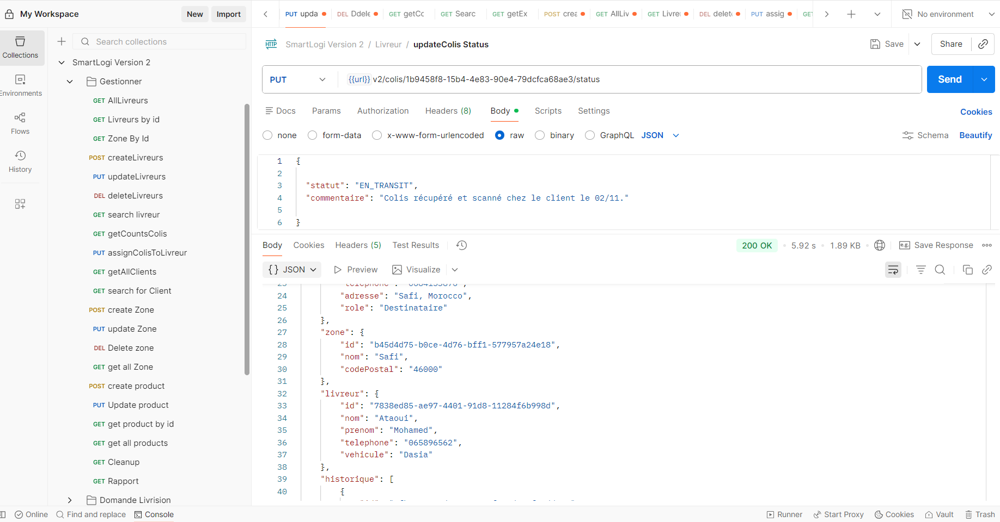
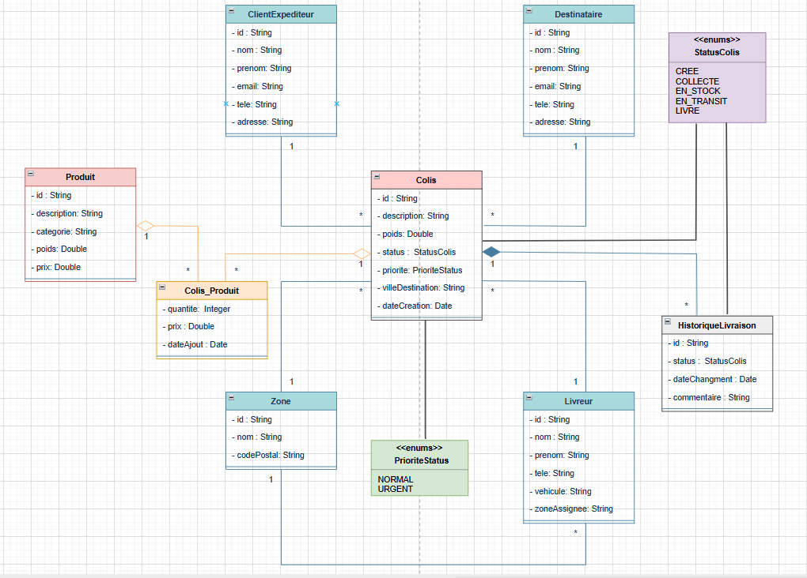
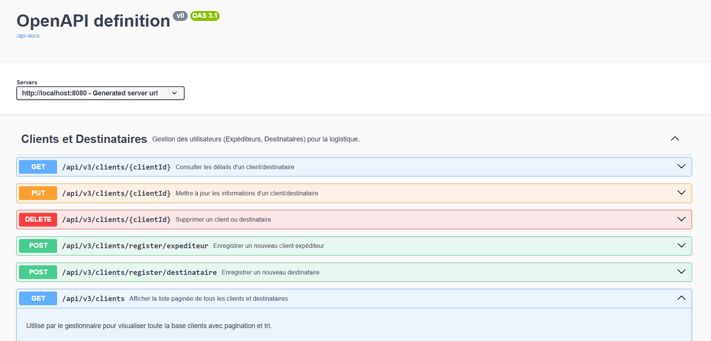
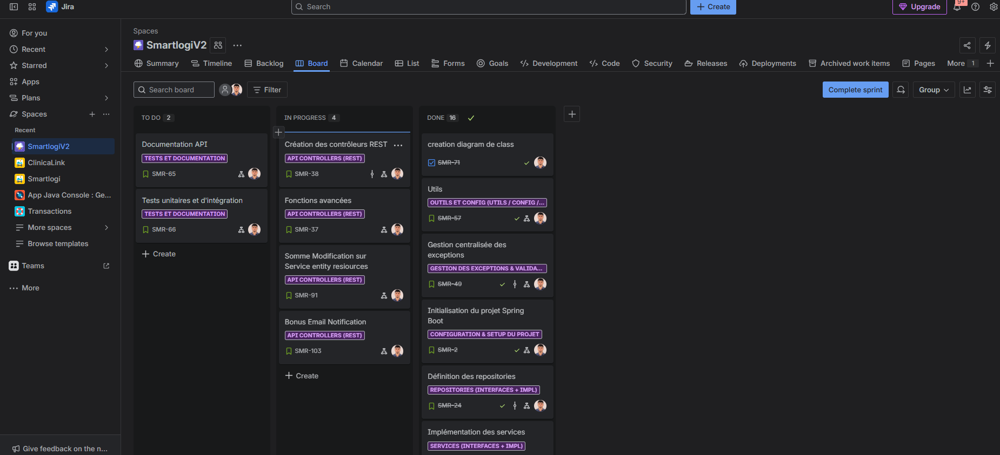

# 🚚 SmartLogi V2 Delivery Management System – Système de Gestion des Livraisons

### Modernisez la logistique des colis avec une application **Spring Boot / JPA / REST API** centralisée et performante.

---

## 🌟 Contexte du Projet

La société **SmartLogi**, spécialisée dans la livraison à travers le Maroc, souhaite remplacer sa gestion manuelle (Excel et registres papier) par une **solution numérique intégrée** pour :

- ✅ **Réduire les erreurs** et les doublons dans le suivi des colis.
- 🚀 **Améliorer la planification** et la visibilité en temps réel.
- 🧭 **Centraliser** la gestion des livreurs, clients, zones et colis.

L’application vise à offrir une solution complète de **gestion logistique intelligente (Smart Delivery Management System – SDMS)**, facilitant la collecte, le stockage, la planification et la livraison des colis.

---

## 🏛️ Architecture de l’Application

Ce projet suit une **architecture en couches (Layered Architecture)** basée sur **Spring Boot 3 / Spring Data JPA** :

| Couche | Description |
| :--- | :--- |
| **Controller (API REST)** | Expose les endpoints REST (Livreur, Colis, Client, Destinataire). |
| **Service (Métier)** | Logique métier et transactions via `@Transactional`. |
| **Repository (DAO)** | Accès aux données via `JpaRepository`. |
| **Entity** | Modélisation JPA des objets persistants. |
| **DTO (Data Transfer Object)** | Transfert de données sécurisé et structuré entre couches. |
| **Mapper (MapStruct)** | Conversion automatique entre Entity et DTO. |

---

## 🛠️ Fonctionnalités Implémentées (User Stories)

| Entité | Fonctionnalité | Description Technique |
| :--- | :--- | :--- |
| **Livreur** | Gérer les livreurs (CRUD) | Ajout, consultation, mise à jour et suppression. Recherche par nom, téléphone, véhicule. |
| **Colis** | Gestion des colis | Création et assignation à un livreur existant (vérification d’intégrité). |
| **Colis** | Mise à jour du statut | Transition d’état (CREATED → COLLECTED → IN_STOCK → DELIVERED). |
| **Colis** | Filtrage et recherche | Recherche par statut, priorité, ville ou zone. |
| **Historique** | Traçabilité | Sauvegarde des statuts et changements. |
| **Notifications Email** | (Bonus) | Envoi automatique de mails via SMTP Gmail (Spring Mail). |

---

## 🚀 Technologies Utilisées

| Technologie | Rôle |
| :--- | :--- |
| **Java 17 / Maven** | Langage principal et gestion de dépendances |
| **Spring Boot 3 / Core / Data JPA** | Framework backend complet |
| **Hibernate ORM 6** | ORM pour la persistance relationnelle |
| **PostgreSQL** | Base de données relationnelle |
| **Liquibase** | Gestion et migration de schéma BDD |
| **MapStruct** | Mapping DTO ↔ Entity |
| **Swagger / OpenAPI** | Documentation interactive des APIs |
| **Spring Mail (SMTP Gmail)** | Envoi de notifications email |
| **Tomcat Embedded** | Serveur intégré |
| **Jira** | Suivi des tâches et user stories |

---

## 📂 Structure Détaillée du Projet

```plaintext
📁 SmartLogiV2/
├── pom.xml
├── src/main/java/
│   └── io/github/mahjoubech/smartlogiv2/
│        ├── SmartLogiV2Application.java    (Classe principale)
│        ├── controller/                    (Controllers REST)
│        ├── dto/                           (Objets de transfert)
│        ├── entity/                        (Entités JPA)
│        ├── mapper/                        (MapStruct interfaces)
│        ├── repository/                    (DAO - JpaRepository)
│        ├── service/                       (Interfaces métier)
│        └── service/impl/                  (Implémentations métier)
├── src/main/resources/
│   ├── application.yml                     (Configuration Spring / BDD)
│   └── db/changelog/                       (Scripts Liquibase)
└── docs/
    ├── diagramClass.png
    ├── jira.png
    ├── postman.png
    └── swagger.png
````

---

## 💻 Lancement de l’Application (API REST)

1. **Configurer la base de données PostgreSQL :**

   ```bash
   database: smartlogi_db
   user: postgres
   password: ********
   ```

2. **Configurer les emails (SMTP Gmail) dans `application.yml` :**

   ```yaml
   spring:
     mail:
       host: smtp.gmail.com
       port: 587
       username: your-smartlogi-email@gmail.com
       password: your-app-password
       properties:
         mail.smtp.auth: true
         mail.smtp.starttls.enable: true
   ```

3. **Compiler et exécuter :**

   ```bash
   mvn clean install
   mvn spring-boot:run
   ```

4. **Accéder à l’API :**

   ```
   http://localhost:8080/swagger-ui/index.html
   ```

---

## 📸 Tests Postman

| Action                | Méthode | URL                                          | Statut        |
| :-------------------- | :------ | :------------------------------------------- | :------------ |
| Créer Livreur         | `POST`  | `http://localhost:8080/api/v1/livreurs`      | `201 Created` |
| Lister Livreurs       | `GET`   | `http://localhost:8080/api/v1/livreurs`      | `200 OK`      |
| Mettre à jour Livreur | `PUT`   | `http://localhost:8080/api/v1/livreurs/{id}` | `200 OK`      |
| Créer Colis           | `POST`  | `http://localhost:8080/api/v1/colis`         | `201 Created` |

### 🧪 Capture Postman :



---

## 🗂️ Documentation et Suivi

### 🧭 Diagramme UML :



### 📘 Swagger UI :



### 🗓️ Suivi Jira :



---

## ✉️ Auteur

**👤 Mahjoub Cherkaoui**
📧 [mahjoubcherkaoui@gmail.com](mailto:mahjoubcherkaoui@gmail.com)
💼 [GitHub – Mahjoubech](https://github.com/Mahjoubech)

---

## 🧾 Licence

Projet académique – 2025
© SmartLogi – All rights reserved.

```

---

Souhaites-tu que je te **génère directement le fichier `README.md` téléchargeable** (avec les sections déjà formatées et prêtes à déposer sur GitHub) ?
```
